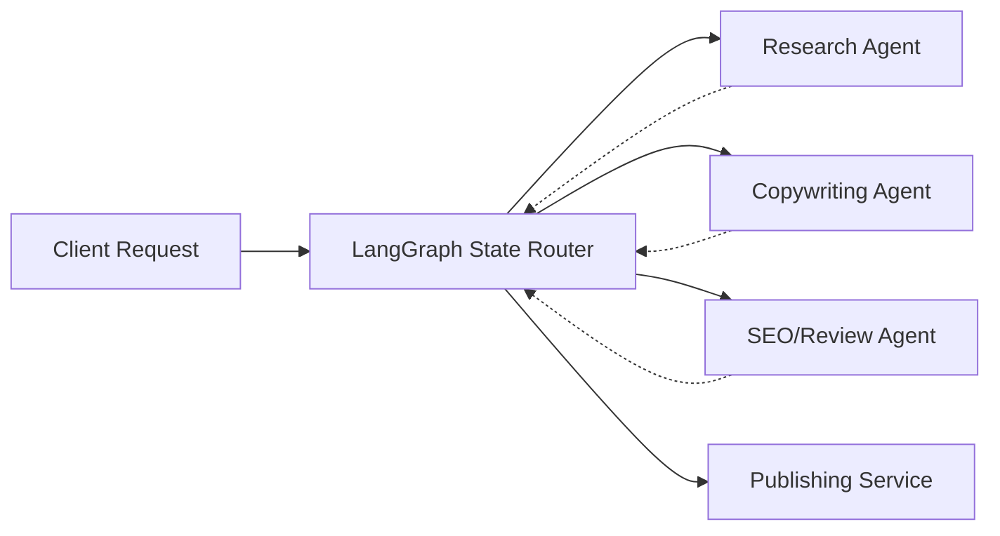

# Service-as-Software Agency (LangGraph)


## 📖 Overview
The **Service-as-Software Agency** utilizes LangGraph to create a fully autonomous, stateful AI marketing agency. This system replaces traditional agency retainers by automating end-to-end content generation, SEO optimization, social media scheduling, and overarching brand strategy.

## ✨ Key Features
- **LangGraph Orchestration:** Stateful, cyclic execution of marketing agents that can critique, refine, and approve each other's work.
- **Automated Content Drafting:** Generates SEO-optimized blog posts, newsletters, and ad copy from brief conceptual inputs.
- **Multi-Channel Scheduling:** Direct integration with social media APIs (Twitter, LinkedIn) for coordinated campaign rollouts.
- **Brand Voice Consistency:** Embeds customer-specific brand guidelines into the vector space to ensure consistent tone.

## 🏗 System Architecture


## 📂 Repository Structure
- `ai_engine/`: LangGraph definitions, nodes, state schemas, and custom tools.
- `backend/`: FastAPI application exposing agency workflows via REST endpoints.
- `infra/`: Docker configurations for robust deployment.

## 🚀 Getting Started

### Local Development
1. Clone the repository and install dependencies:
   ```bash
   pip install -r requirements.txt
   ```
2. Start the FastAPI backend:
   ```bash
   uvicorn backend.main:app --host 0.0.0.0 --port 8000
   ```
3. Trigger a marketing campaign generation via the Swagger UI at `http://localhost:8000/docs`.

## 🛠 Known Issues
- Implement multi-agent communication fallback.

## 🤝 Contributing
Issues and PRs focusing on extending LangGraph tools and third-party integrations are highly encouraged.

## ?? Future Roadmap & Enhancements
- **A/B Testing Simulator**
- **Interactive Human-in-the-Loop dashboard**
